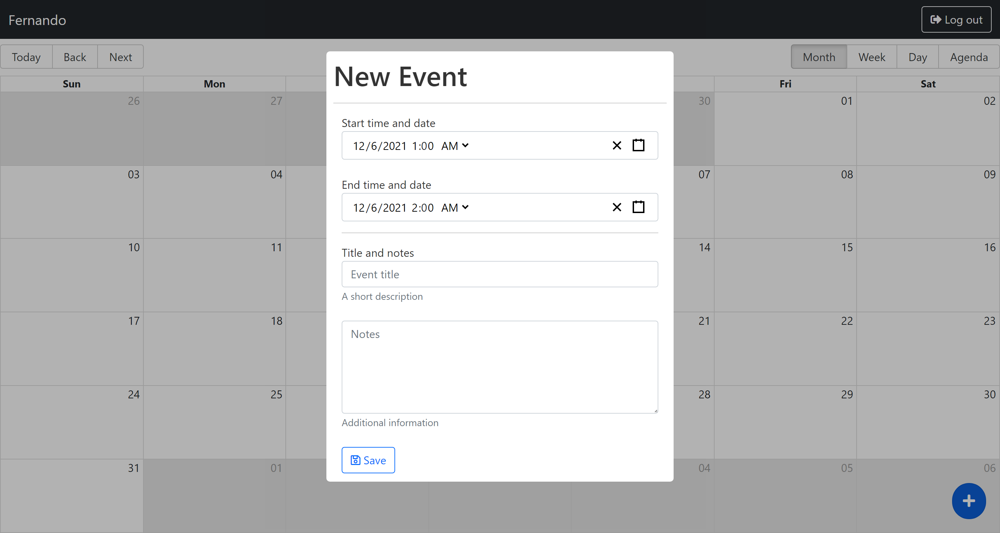

# MERN Calendar

This app was built using the MERN Stack: React for the User interface, Node.js and Express.js for the backend and server for generate the endpoints and MongoDB for the database. This is a CRUD app with authentication.

## Table of contents

- [Overview](#overview)
  - [The project](#the-project)
  - [Screenshot](#screenshot)
  - [Links](#links)
- [My process](#my-process)
  - [Built with](#built-with)
  - [What I learned](#what-i-learned)
  - [Useful resources](#useful-resources)
- [Author](#author)

## Overview

### The project

Users should be able to:

- Register in the app
- Login with email and password
- See events on the calendar
- Create a new event
- Edit their own events (The are not allow to edit someone else event)
- Delete events

### Screenshot

### Links

- Solution URL: [Solution URL here]()
- Live Site URL: [Live site URL here](https://mern-calendar-ncondes.herokuapp.com/)

## My process

### Built with

- Semantic HTML5 markup
- CSS custom properties
- Flexbox
- CSS Grid
- Mobile-first workflow
- Bootstrap
- Moment
- Big calendar
- Redux
- React Modal
- Jest
- Enzyme
- [React](https://reactjs.org/) - JS library
- [Node](https://nodejs.org/en/) - Node JS
- [Express](https://expressjs.com/) - Express JS
- [MongoDB](https://www.mongodb.com/) - MongoDB

### What I learned and put into practice

- Make the layout ( structure and styles ) of the app
- Redux ( types, actions, reducers, store )
- Validations in the form inputs
- CRUD ( Create, Read, Update, Delete )
- Unit and integration test with jest and enzyme
- Create an API to make requests
- Deploy the backend

### Useful resources

- [Mongo Compass](https://www.mongodb.com/products/compass) - This is the desktop database app to save the data of the calendar app.
- [Postman](https://www.postman.com/) - This is an amazing resource to make request to an API and check the data that you will work with.

## Author

- Website - [Nicolas Conde Salazar](https://www.ncondes.com)
- Linkedin - [Nicolas Conde Salazar](https://www.linkedin.com/in/ncondes/)
